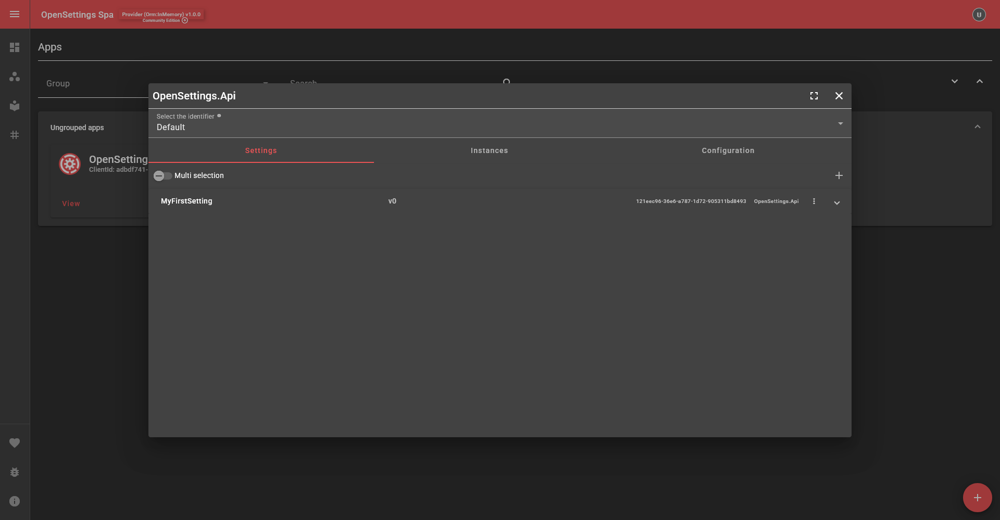

# Introduction

## Why OpenSettings?  

When starting a new project, dotnet developers often need to configure application settings, typically using **IConfiguration** and `appsettings.json` or `app.config`.  

- Bind Set up **IConfiguration** and read from a file (Unless using `WebHost.CreateDefaultBuilder`).  
- Bind it to a **model** where the property names must match exactly.  
- Decide whether to store it as a **Singleton** or use `IOptions<T>`.  
- Handle **XML-based configurations**, which require `ConfigurationSection` and attributes like `[ConfigurationProperty]`.  

This process is **repetitive, error-prone, and time-consuming**.  

## The Real Problem  

Once the application is **deployed**, updating configuration values can be **painful**.  

### 🔴 Traditional Approach:  

- Manually update **appsettings.json** in **each instance** of the application then update the repository with the new assigned value.  
- If multiple instances exist (e.g., **30+ deployments**), you need to:  
  - **Create a new branch**  
  - **Update the file**  
  - **Build & redeploy the entire application**  
  - **Follow approval processes** (change tickets, changelogs, etc.)  
  - **Rollback if needed**, which means finding the previous version and redeploying it again.  

### 💡 Challenges:  

- 🔄 **Version control of configuration files is difficult**.  
- ⏳ **Instant changes are not possible**—a full redeployment is required.  
- ❌ **Wasted time and effort** for minor updates.  

## The OpenSettings Solution 🚀  

Instead of managing configurations manually, **why not store them in persistent storage** and let services sync them automatically?  

✅ OpenSettings **centralizes application settings** in a **persistent storage** (database, cloud storage, etc.).  

✅ When a configuration update is needed, **it is updated in one place**, and all services retrieve the latest values.  

✅ **No need to redeploy** the application just to change a setting!  

## Key Features & Benefits  

### 🖥️ **Settings Page**  
OpenSettings provides a **user-friendly UI** where settings can be managed **with just a few clicks**.  

No need to manually edit config files—simply update values in the **dashboard**!  

### 🔧 **Three Core Libraries**  
OpenSettings is built as a **modular system** with three main components:  

1️⃣ **OpenSettings** → The **core library** that handles configuration management logic.  

2️⃣ **OpenSettings.AspNetCore** → Exposing controllers and authentication handlers to manage and interact with OpenSettings.  

3️⃣ **OpenSettings.AspNetCore.Spa** → Serves the **Settings Page UI**, allowing easy management of configurations.  

## Consumer vs. Provider: What Do They Mean?  

The OpenSettings library can run as either a **Provider** or a **Consumer**, depending on how an application retrieves configuration values.  

### **Provider Mode 🏗️**  
A **Provider** is responsible for **fetching and storing data in a persistent storage**.  

Example:  
- You have an **`EmailSender.Api`** service that needs email-related settings.  
- If `EmailSender.Api` directly **connects to the database/storage**, it acts as a **Provider**.  

### **Consumer Mode 🏭**  
A **Consumer** retrieves settings **from a Provider service** instead of accessing storage directly.  

Example:  
- You set up a dedicated service, **`OpenSettings.Api`**, as the **Provider**.  
- `EmailSender.Api` **requests its settings from `OpenSettings.Api`**, instead of fetching from the database.  
- This setup ensures a **single source of truth** and keeps other services focused on their main functionality.  

### ✅ Suggested Architecture  
The recommended approach is to have a **separate OpenSettings Api** that acts as a **Provider**, while all other services act as **Consumers**.  

#### 📌 Example Setup:  
- ✅ **`OpenSettings.Api`** → Fetches & serves settings.  
- ✅ **`EmailSender.Api` (Consumer)** → Retrieves settings from `OpenSettings.Api`.  
- ✅ **`UserManagement.Api` (Consumer)** → Retrieves settings from `OpenSettings.Api`.  

This architecture ensures **better scalability, security, and centralized management**.  

## Key Considerations & Risks  

### ⚠ Provider vs. Consumer Mode:  

- If **all services act as providers**, the main risk is the **high availability of persistent storage**.  
- If **all services are consumers**, they rely on a **provider service** to fetch settings. The provider must always be **up & running**.  

### ⚠ Startup Dependency:  

- By default, OpenSettings **fetches settings at runtime**.  
- If the provider is **down**, the service must decide **whether to wait or terminate**.  

To avoid this, OpenSettings supports **pre-generated settings files** that can be embedded **at build time (CI/CD)**.  

OpenSettings also allows **offline mode**, where an **initial hardcoded settings file** is used before switching to the provider.  

## Current Scope and Future Potential

While OpenSettings is primarily designed to work with .NET applications, its architecture is flexible enough that, in the future, it could support other programming languages.

This means that **OpenSettings.Api** can store settings for non-.NET applications, but building this functionality for other programming languages would require a custom SDK.

## Conclusion  

OpenSettings **is not a one-day project**—it's a powerful tool that solves **real-world configuration management challenges**.  

It eliminates **boilerplate**, simplifies updates, and **improves maintainability** across multiple services.  

🚀 As the project grows, **OpenSettings can become an even more versatile and efficient configuration management tool!** 