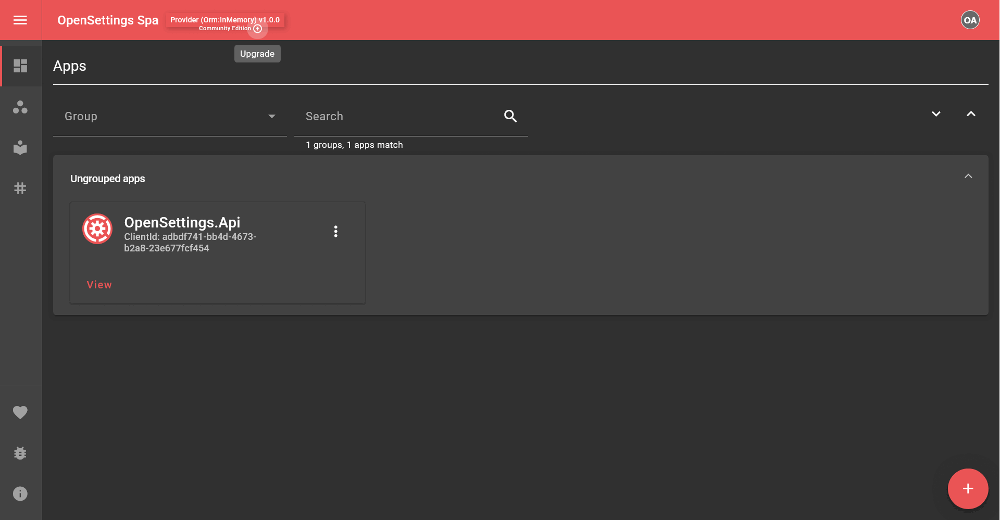

# License Setup Guide

## 📌 Introduction  
This guide explains how to set up the license for OpenSettings.

---

There are 3 ways to set up the license:

* ### **Via OpenSettingsConfiguration**

    ```csharp
    var openSettingsProviderConfiguration = new OpenSettingsConfiguration(ServiceType.Provider)
    {
        ...
        Provider = new ProviderConfiguration
        {
            ...
            LicenseKey = "YOUR-LICENSE-KEY"
            ...
        }
        ...
    };
    ```

    If the license key is invalid or missing, it will search for the `OpenSettings-License.key` file.

* ### **From Folder**

    Create a file named `OpenSettings-License.key`, paste your license key into the file, and place it next to the executable DLL.

    If the file is not found or the license is invalid, it will try to retrieve the license from the database.

* ### **Via Settings Page**

    This can also be added through the settings page. Simply navigate to your service's settings page and follow the steps shown in the gif below:

    

> [!NOTE]
> If not specified, the license will default to the **community license**. If a license is already assigned but invalid or expired, or if an exception occurs during initialization, it will fall back to the **community license**.

> [!NOTE]
> Only providers can specify the license; consumers do not need it, as this information is provided by the provider.

> [!NOTE]
> If multiple licenses added, the **highest** edition with the **longest expiry date** takes precedence.

---

### 📞 **Contact Us**
For any inquiries related to the license, please feel free to reach out at [license@opensettings.net](mailto:license@opensettings.net).

---

## ✅ What's Next?

---

✨ *OpenSettings makes settings management simple and efficient!* 🚀