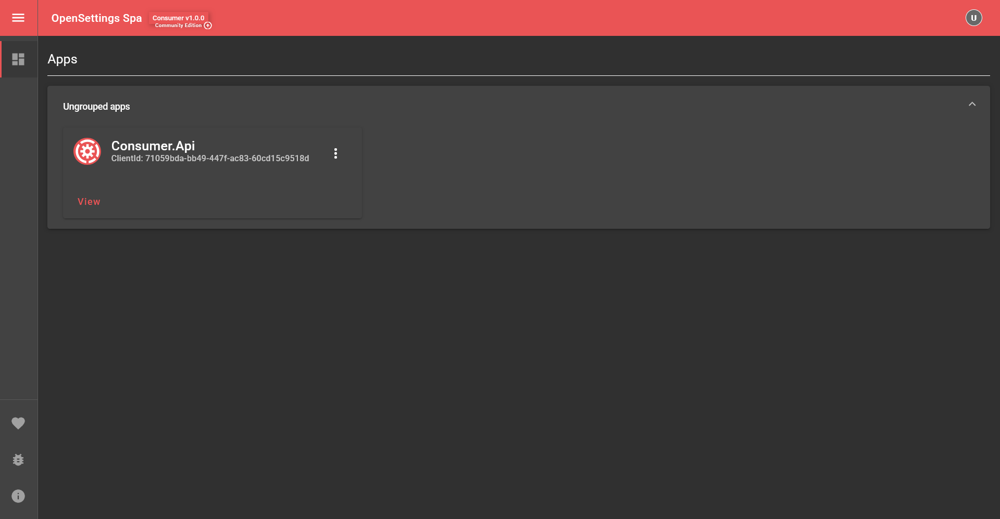

# Setting Up The Consumer

## Installation and Setup

To get started with OpenSettings as a consumer, you must first complete the [Setting Up The Provider](quick-start-provider.md) quick start. The consumer relies on a provider to function correctly. Once you've completed, follow this guide to set up the consumer.

Let's create a new web project for the consumer and install the required libraries.

### 1️⃣ Create a New Web API Project

Run the following commands to create a new web project for OpenSettings:

```bash
dotnet new web -o Consumer.Api
cd Consumer.Api
```

### 2️⃣ Install OpenSettings
```sh
dotnet add package OpenSettings.AspNetCore
```

## 🏗 Setting Up

Now, let's configure OpenSettings for the **Consumer** application.

```csharp
var builder = WebApplication.CreateBuilder(args);

var openSettingsConsumerConfiguration = new OpenSettingsConfiguration(ServiceType.Consumer)
{
    Client = new ClientInfo(
        new Guid("71059bda-bb49-447f-ac83-60cd15c9518d"), // The unique identifier for the client.
        new Guid("6c52c9f7-d43c-44c1-8d6c-451bf9029731")  // The secret key for the client.
    ),
    Consumer = new ConsumerConfiguration
    {
        ProviderUrl = "http://localhost:5288/api/settings" // Url of the provider service.
    }
};

// Registers OpenSettings
await builder.Host.UseOpenSettingsAsync(openSettingsProviderConfiguration);

builder.Services
    .AddControllers()
    .AddOpenSettingsController(builder.Configuration); // Enables OpenSettings Controllers

var app = builder.Build();

app.UseRouting();
app.UseOpenSettings(); // Updates instance status when the application starts or stops.
app.UseOpenSettingsSpa(); // Enables OpenSettings SPA for viewing & editing settings.
app.MapControllers();

await app.RunAsync();
```

---

## 📌 Creating Your First Setting

Now, let's create a simple setting model.

Create a new class called `MyFirstSetting` and implement `ISettings`:

```csharp
using OpenSettings.Services.Interfaces;

public class MyFirstSetting : ISettings
{
    public string Name { get; set; }
    public string Description { get; set; }
}
```

---

## 🔎 Accessing the Settings Page  

First, start the **Provider** application (OpenSettings.Api), then run the **Consumer** application (Consumer.Api). The logs should display where the servers are running:

### Provider.Api
```bash
info: Microsoft.Hosting.Lifetime[14]
      Now listening on: https://localhost:7055
info: Microsoft.Hosting.Lifetime[14]
      Now listening on: http://localhost:5288
```  

### Consumer.Api
```bash
info: Microsoft.Hosting.Lifetime[14]
      Now listening on: https://localhost:7057
info: Microsoft.Hosting.Lifetime[14]
      Now listening on: http://localhost:5290
```  

By default, the **OpenSettings Spa** is accessible at the relative URL `/settings`.  

🔗 To open the Consumer's settings page in your browser: **[http://localhost:5290/settings](http://localhost:5290/settings)**



🔗 To open the Provider's settings page in your browser: **[http://localhost:5288/settings](http://localhost:5288/settings)**

> [!NOTE]
> If you access the settings page through the **Provider**, you can view all registered applications.  
> If you access the settings page through the **Consumer**, you will only see the current application’s settings.  

---

## 🚀 Do You Want To Start Even Faster?  

Clone the repository and run the application instantly:  

```bash
git clone git@github.com:OpenSettings/open-settings-samples.git
cd open-settings-samples/versions/v1/quick-starts/2-quick-start-consumer/src/OpenSettings.Api/
dotnet run
cd ../Consumer.Api/
dotnet run
```

That's it! OpenSettings.Api & Consumer.Api will be up and running in seconds. 🎉  

---

## ✅ What's Next?

- **Explore the consumer functionality:** [Consumer Guide](consumer-guide.md)
- **Securing OpenSettings:** Learn more in the [Security Guide](security-guide.md)

---

✨ *OpenSettings makes settings management simple and efficient!* 🚀