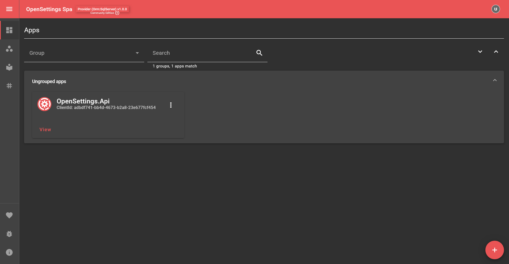

# Persistent Storage

## Installation and Setup

To start, you must first complete the [Setting Up The Provider](quick-start-provider.md) quick start. Once you've completed it, you can proceed.

Let's open **OpenSettings.Api** and configure persistent storage.

OpenSettings does not contain built-in storage. You must decide which storage you want and configure it yourself. In the [Setting Up The Provider](quick-start-provider.md) quick start, we set up **InMemory** storage, meaning data is recreated every time the application restarts. If we want persistent storage, we need to configure a database.

For this quick start, we'll use **SQL Server**, but the steps are similar for other databases.

### 1️⃣ Install SQL Server Package

```sh
dotnet add package Microsoft.EntityFrameworkCore.SqlServer
```

```csharp
var migrationsAssembly = typeof(Program).Assembly.GetName().Name;

openSettingsProviderConfiguration.Provider.Orm.ConfigureDbContext = optsBuilder =>
{
    // Configure your database provider here. (e.g. UseSqlServer, UseNpgsql, UseInMemoryDatabase)
    //optsBuilder.UseInMemoryDatabase("OpenSettings");
    optsBuilder.UseSqlServer(
        @"Data Source=(localdb)\MSSQLLocalDB;Initial Catalog=OpenSettings;Integrated Security=True;MultipleActiveResultSets=True",
        opts => opts.MigrationsAssembly(migrationsAssembly));
};
```

In this example, we use **MSSQLLocalDB** instance, but you can modify the connection string to match your setup.

### 2️⃣ Install EF Core Tools

To create migrations, install the [EF Core Tools](https://learn.microsoft.com/en-us/ef/core/cli/dotnet):

```sh
dotnet tool install --global dotnet-ef
```

EF Core Tools require **Microsoft.EntityFramework.Design** package to work.

```sh
dotnet add package Microsoft.EntityFrameworkCore.Design
```

### 3️⃣ Generate Database Migrations

Run this command inside the **OpenSettings.Api** folder:

```sh
dotnet ef migrations add InitialOpenSettingsDbMigration -c OpenSettingsDbContext -o Data/Migrations/OpenSettings/OpenSettingsDb --configuration Migration
```

> [!TIP]
> Make sure not to forget to pass the **--configuration Migration** parameter when generating migrations.

Migrations generate database schemas and relationships.

Now, run the application to verify that your database is created.



---

### 4️⃣ Configuring Connection Strings in `appsettings`

Hardcoding connection strings in the code is not recommended. Instead, store it in `appsettings.json`:

```json
{
  "Logging": {
    "LogLevel": {
      "Default": "Information",
      "Microsoft.AspNetCore": "Warning"
    }
  },
  "AllowedHosts": "*",
  "SqlServerConnectionString": "Data Source=(localdb)\\MSSQLLocalDB;Initial Catalog=OpenSettings;Integrated Security=True;MultipleActiveResultSets=True",
  "OpenSettingsConfiguration": {
    "Client": {
      "Id": "adbdf741-bb4d-4673-b2a8-23e677fcf454",
      "Secret": "4294a5e3-0839-4358-a03d-1ac52585ae5f"
    },
    "Selection": 1
  }
}
```

### 5️⃣ Load Configuration in `Program.cs`

Before `dotnet` initializes, load the configuration:

```csharp
var configuration = new ConfigurationBuilder()
    .AddJsonFile("appsettings.json")
    .AddJsonFile($"appsettings.{OpenSettings.Helper.GetEnvironmentName()}.json", optional: true)
    .Build();
```

Create a method to retrieve the **OpenSettingsConfiguration**:

```csharp
static OpenSettingsConfiguration GetOpenSettingsConfiguration(IConfiguration configuration)
{
    var migrationsAssembly = typeof(Program).Assembly.GetName().Name;

    var settingsServiceConfiguration = configuration.GetSection(nameof(OpenSettingsConfiguration)).Get<OpenSettingsConfiguration>();

    settingsServiceConfiguration.Provider.Orm.ConfigureDbContext = optsBuilder =>
    {
        optsBuilder.UseSqlServer(configuration["SqlServerConnectionString"], opts => opts.MigrationsAssembly(migrationsAssembly));
    };

    return settingsServiceConfiguration;
}
```

Then, use this method in your setup:

```csharp
var openSettingsProviderConfiguration = GetOpenSettingsConfiguration(configuration);
```

## 🚀 Do You Want To Start Even Faster?  

Clone the repository and run the application instantly:  

```bash
git clone git@github.com:OpenSettings/open-settings-samples.git
cd open-settings-samples/versions/v1/quick-starts/3-quick-start-persistent-storage/src/OpenSettings.Api/
```

### 🔧 Configure Your Database  

Before running the project, update your database configuration:

- Modify **`SqlServerConnectionString`** in `appsettings.json` to match your database.
- If you're using a different database provider (e.g., PostgreSQL, MySQL), install the required package, update the database configuration in `settingsServiceConfiguration.Provider.Orm.ConfigureDbContext`, **delete the `Data` folder**, and rerun migrations (see [Generate Database Migrations](#3-generate-database-migrations)).

### ▶️ Run the Project  

Once configured, start the application:

```sh
dotnet run
```

That's it! **OpenSettings.Api** will be up and running in seconds. 🎉  

---

## ✅ What's Next?

---

✨ *OpenSettings makes settings management simple and efficient!* 🚀