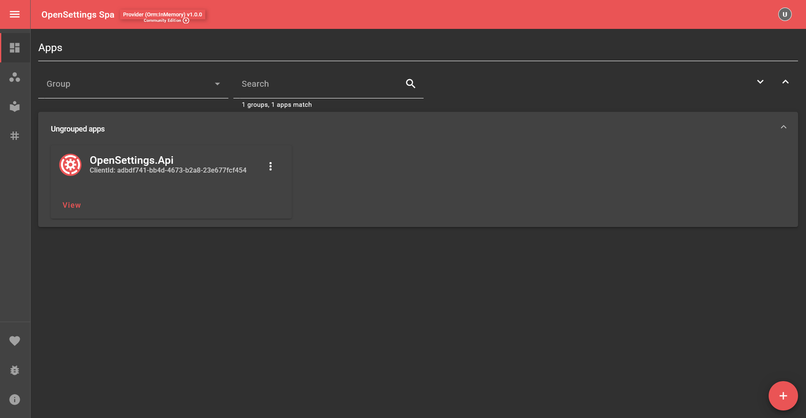

# Setting Up The Provider

## 📥 Installation and Setup

To get started with OpenSettings as a provider, you'll first need to create a new web project and install the required libraries.

### 1️⃣ Create a New Web API Project

Run the following commands to create a new web project for OpenSettings:

```bash
dotnet new web -o OpenSettings.Api
cd OpenSettings.Api
```

### 2️⃣ Install OpenSettings
```sh
dotnet add package OpenSettings.AspNetCore
```

### 3️⃣ Install a Storage Provider
For this quick start, we'll use **InMemory storage**. You can install it with:

```sh
dotnet add package Microsoft.EntityFrameworkCore.InMemory
```

If you're using a different database, replace this package with the appropriate EF Core provider (e.g., `Microsoft.EntityFrameworkCore.SqlServer` for SQL Server).

---

## 🏗 Setting Up

Now, let's configure OpenSettings for the **Consumer** application and use **InMemory** storage.

```csharp
var builder = WebApplication.CreateBuilder(args);

var openSettingsProviderConfiguration = new OpenSettingsConfiguration(ServiceType.Provider)
{
    Client = new ClientInfo(
        new Guid("adbdf741-bb4d-4673-b2a8-23e677fcf454"), // The unique identifier for the client.
        new Guid("4294a5e3-0839-4358-a03d-1ac52585ae5f")  // The secret key for the client.
    )
};

// Configure database storage (InMemory for this example)
openSettingsProviderConfiguration.Provider.Orm.ConfigureDbContext = optsBuilder =>
{
    optsBuilder.UseInMemoryDatabase("OpenSettings");
};

// Registers OpenSettings
await builder.Host.UseOpenSettingsAsync(openSettingsProviderConfiguration);

builder.Services
    .AddControllers()
    .AddOpenSettingsController(builder.Configuration); // Enables OpenSettings Controllers

var app = builder.Build();

app.UseRouting();
app.UseOpenSettings(); // Updates instance status when the application starts or stops.
app.MapControllers();

await app.RunAsync();
```

---

## 📌 Creating Your First Setting

Now, let's create a simple setting model.

Create a new class called `MyFirstSettings` and implement `ISettings`:

```csharp
using OpenSettings.Services.Interfaces;

public class MyFirstSettings : ISettings
{
    public string Name { get; set; }
    public string Description { get; set; }
}
```

---

## 🔎 Accessing the Settings Page  

Now, run the application, and you'll see logs indicating where the server is running:  

```bash
info: Microsoft.Hosting.Lifetime[14]
      Now listening on: https://localhost:7055
info: Microsoft.Hosting.Lifetime[14]
      Now listening on: http://localhost:5288
```  

By default, the **OpenSettings Spa** is accessible at the relative URL `/settings`.  

🔗 Open the settings page in your browser:  
**[http://localhost:5288/settings](http://localhost:5288/settings)**  

This page allows you to **view and edit your application settings** directly through the OpenSettings Spa (Single Page Application).



---

## 🚀 Do You Want To Start Even Faster?  

Clone the repository and run the application instantly:  

```bash
git clone git@github.com:OpenSettings/open-settings-samples.git
cd open-settings-samples/versions/v1/quick-starts/1-quick-start-provider/src/OpenSettings.Api/
dotnet run
```

That's it! OpenSettings will be up and running in seconds. 🎉  

---

## ✅ What's Next?

- **Set up your first consumer application:** [Setting Up The Consumer](quick-start-consumer.md)
- **Explore the configuration:** [Configuration Guide](configuration-guide.md)
- **Need persistent storage?** Check out the [Persistent Storage](quick-start-persistent-storage.md) options (SQL Server, PostgreSQL, etc.)
- **Securing OpenSettings:** Learn more in the [Security Guide](security-guide.md)

---

✨ *OpenSettings makes settings management simple and efficient!*