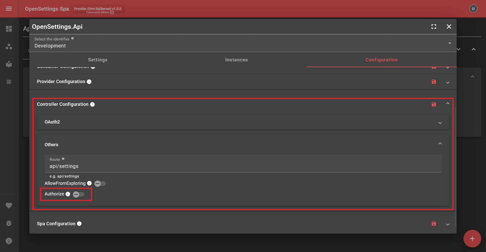
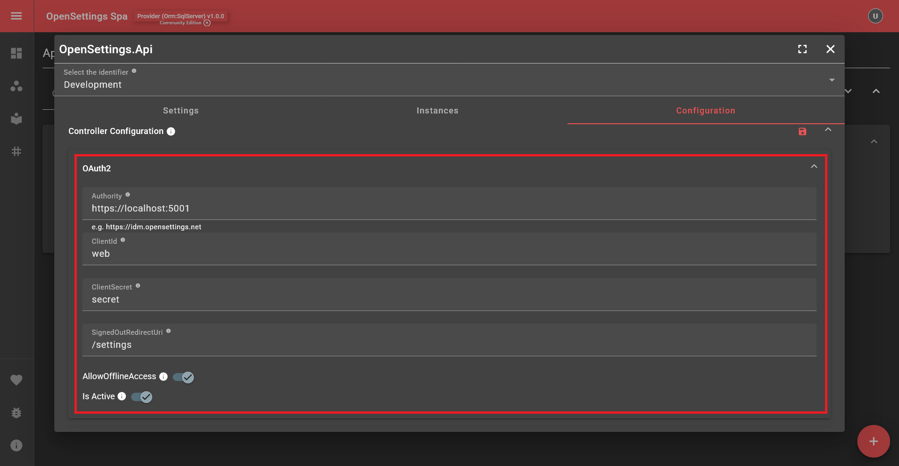

# Securing OpenSettings

By default, OpenSettings does **not** enforce authorization. To secure the application, you must explicitly protect controller access.  

OpenSettings provides **built-in Basic Authentication**, and API communication **defaults to Basic Authentication**.

## 🔹 Enabling Authorization  

To protect controllers, enable the OpenSettings controller configuration from the Open Settings Spa:



> [!TIP]
> Don’t forget to press the Save button on the right side of the section. A restart is required after saving for the changes to take effect.

If your application acts as a **consumer** and `Authorize = false`, this does **not** necessarily mean the service is insecure, as the **ultimate decision depends on the provider**.

---

## 🔹 Provider & Consumer Authorization Behavior  

The following table illustrates different authorization configurations and their outcomes:  

| **Provider (Authorize)** | **Consumer (Authorize)** | **Final Authorization Behavior** |
|--------------------------|--------------------------|----------------------------------|
| ✅ `true`               | ❌ `false`              | 🔒 `true` for both Consumer & Provider |
| ❌ `false`              | ✅ `true`               | 🔒 `true` for Consumer, ❌ `false` for Provider |
| ❌ `false`              | ❌ `false`              | ⚠️ `false` (⚠️ Insecure: Anyone can access controllers) |
| ✅ `true`               | ✅ `true`               | 🔒 `true` for both Consumer & Provider |

When `Authorize = true`, accessing the OpenSettings controllers or settings page requires authentication. If authentication is needed, the settings page will automatically redirect users to a **login page**.  

## 🔹 Authentication Credentials  

By default, authentication uses **ClientInfo** credentials set during the initial setup:

- **ClientId:** `principal`
- **ClientSecret:** `password`

Once logged in, users have **full access**. There is **no role-based authentication** or permission management.

---

## 🔹 Using OAuth2 for Authentication  

If you prefer to use **OAuth2 authentication**, OpenSettings allows integration with your OAuth2 provider.

Modify the configuration as follows:



### OAuth2 Configuration Explained:
- **Authority:** The Url of your identity provider. For instance, https://idm.opensettings.net
- **ClientId & ClientSecret:** Must be configured in your identity provider.
- **AllowOfflineAccess:** Enables refresh tokens.
- **IsActive:** Determines if OAuth2 is enabled.

> [!NOTE]
> If your service is running as a **consumer**, you do **not** need to manually configure OAuth2. The **provider** shares the required authentication settings during startup.

---

## 🔹 Registering Middleware  

To enable authentication and authorization, register the middleware **before** `app.MapControllers();`.  
A typical pipeline setup looks like this:

```csharp
...
app.UseRouting();
app.UseOpenSettings();
app.UseAuthentication();
app.UseAuthorization();
app.MapControllers();
...
```

That's it! OpenSettings is now secured. 🔒  

---

## ✅ What's Next?  

---

✨ *OpenSettings makes settings management simple and efficient!* 🚀