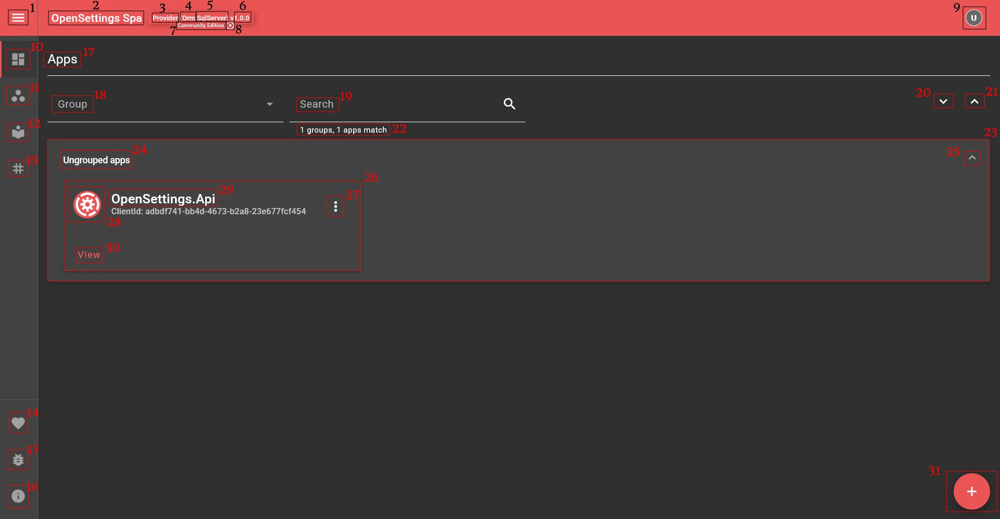
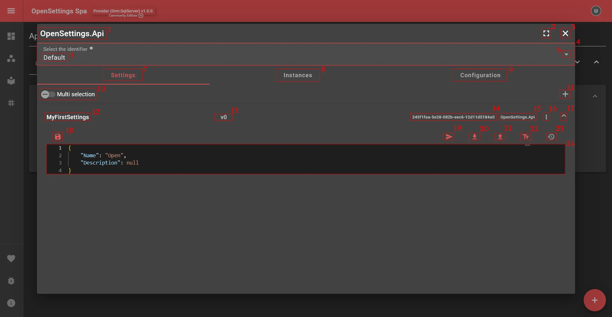
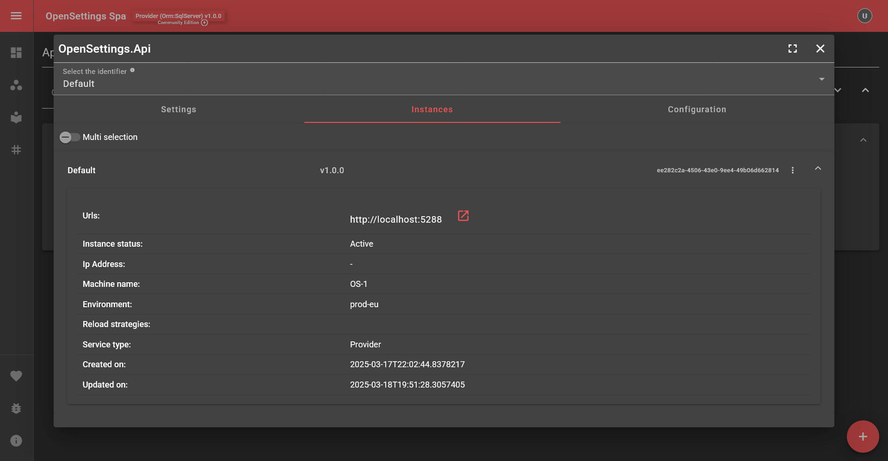
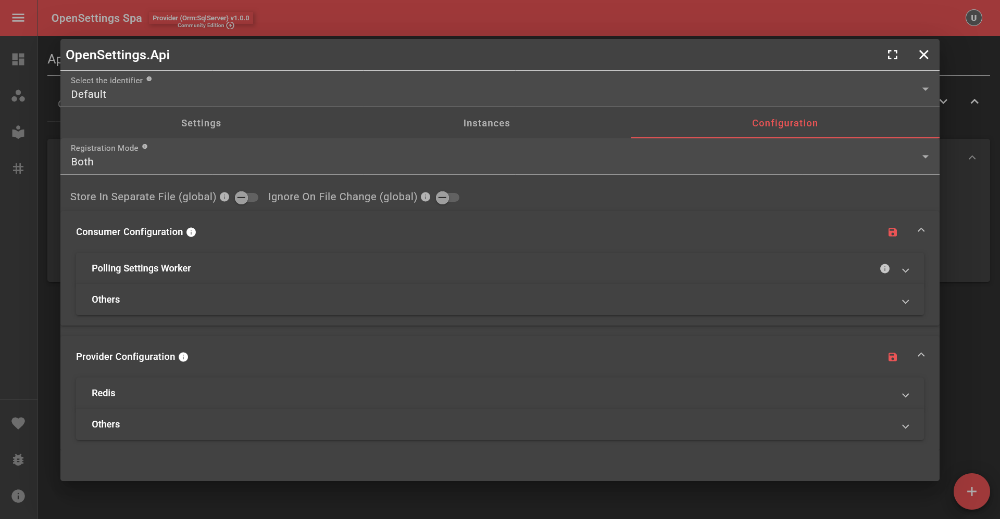
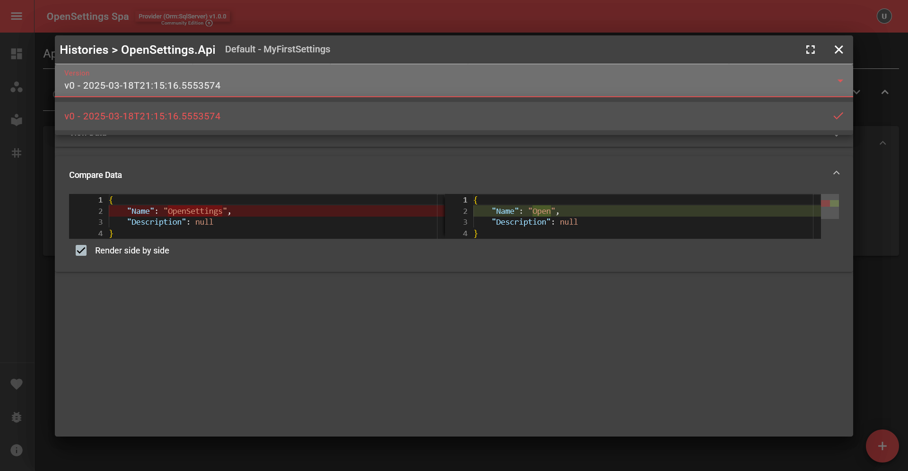
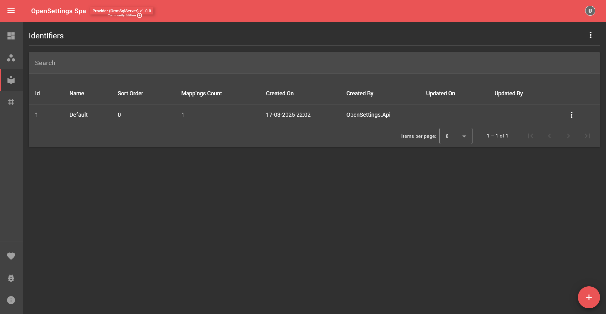
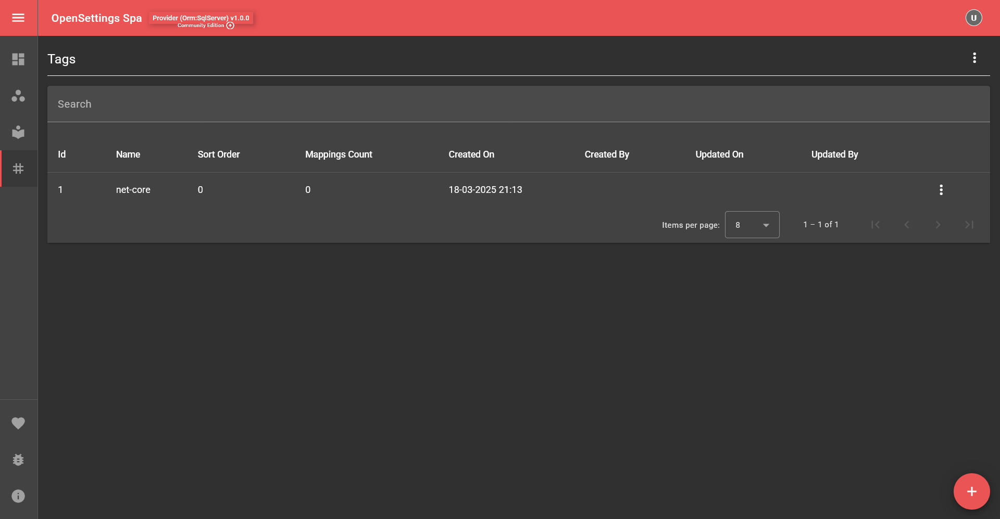
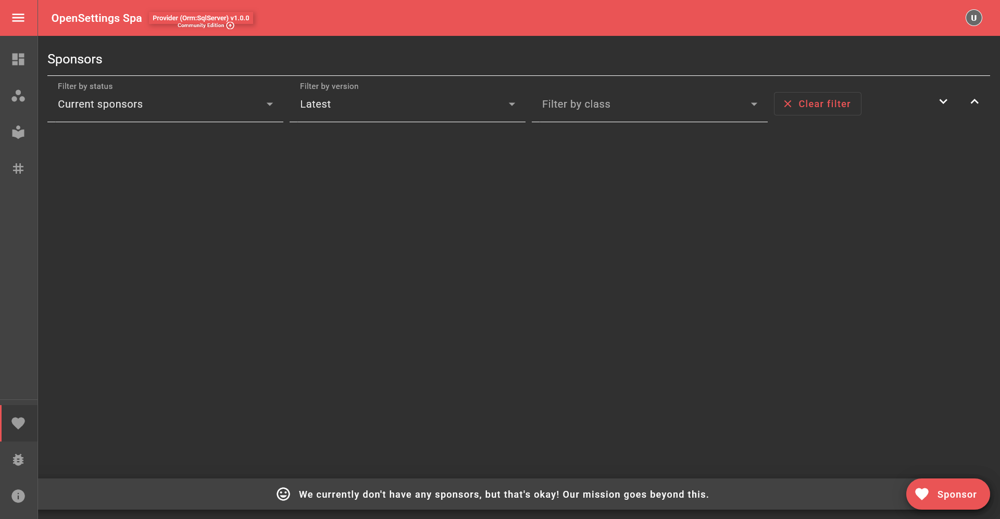
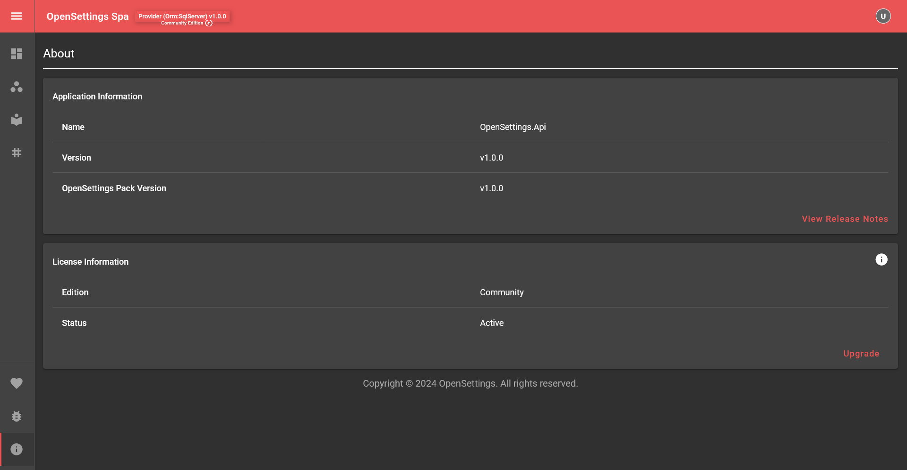

# Settings Page

## 📌 Introduction

The Settings page is the OpenSettings settings management user interface. The `OpenSettings.AspNetCore.Spa` library provides this functionality, and in this guide, we'll explore how to configure and use it.

You can register the settings Spa (Single Page Application) with:

```csharp
app.UseOpenSettingsSpa();
```

By default, the settings page is available at the relative URI settings. You can customize this by configuring the options as follows:

```csharp
app.UseOpenSettingsSpa(opts =>
{
    opts.RoutePrefix = "my-new-route";
});
```

Now, the settings page will be accessible at `.../my-new-route`. The `...` represents your service's host address (e.g., `https://localhost:5000/my-new-route`).

---

### Examining the Initial Page



1) **Menu Toggle**: Toggles the menu.
2) **Document Title**: Can be customized using `app.UseOpenSettingsSpa(opts => opts.DocumentTitle = "OpenSettings Spa");`
3) **Service Type**: Shows whether the accessed site is running as Provider or Consumer.  
4) **Data Access Type**: If running as a provider, shows which data access type is in use.  
5) **Database Provider Name**: If running as a provider, shows which database provider is used.  
6) **OpenSettings Version**: Displays the version of the OpenSettings package.  
7) **License Info**: Shows the current license details for the site.  
8) **License Upgrade/Renew Button**: Opens a modal for quick license upgrades or renewals.  
9) **Account Menu**: Opens the account menu, containing Notifications, Theme Settings, and Quick Links.  
10) **Apps Tab**: Switches to the app list.  
11) **Groups Tab**: Switches to the group list.  
12) **Identifiers Tab**: Switches to the identifier list.  
13) **Tags Tab**: Switches to the tag list.  
14) **Sponsors Tab**: Switches to the sponsor list.  
15) **Bug Report**: Opens a separate page for reporting issues.  
16) **About Tab**: Displays information about the application and license.  
17) **Tab Name**: Displays the currently active tab.  
18) **Group Filter**: Filters items based on groups.  
19) **Search Filter**: Allows searching within the settings.  
20) **Expand All Groups**: Expands all groups for a detailed view.  
21) **Collapse All Groups**: Collapses all groups for a compact view.  
22) **Results Section**: Displays the content for the selected tab or filter.  
23) **Group Section**: Contains multiple apps within a group.  
24) **Group Name**: Shows the name of the group.  
25) **Collapse Group**: Hides the content of a group.  
26) **App Section**: Displays individual apps.  
27) **App Actions**: Offers Update and Delete options for the app.  
28) **App Icon**: Displays the app's icon from the Image URL in app update settings.  
29) **App Display Name**: Shows the display name of the app.  
30) **View App Settings & Configurations**: Opens detailed settings for an app.  
31) **Create New App**: Adds a new app to the system.

---

### Examining the App View Page



1) **App Name**: Displays the name of the app currently being viewed.
2) **Full Screen**: Expands the app view to full screen.
3) **Close App View**: Closes the app view.
4) **Identifier Mappings**: Displays the identifiers included with this app.
5) **Identifier Name**: Shows the identifier name.
6) **Open Identifier Mappings Selection**: Opens the identifier selection dialog.
7) **Settings Tab**: Displays the settings associated with the app.
8) **Instances Tab**: Shows different instances of the app.
9) **Configuration Tab**: Displays app configuration options.
10) **Multi-Selection Mode**: When enabled, allows multiple settings to remain open.
11) **Add New Setting**: Creates a new setting entry.
12) **Class Name**: Displays the class name for the setting.
13) **Current Settings Version**: Shows the version identifier assigned for tracking changes.
14) **Computed Identifier**: Displays the computed identifier for the setting.
15) **Namespace**: Shows the namespace of the setting.
16) **Settings Actions**: Provides Update and Delete options for the setting.
17) **Collapse Setting**: Collapses the currently selected setting.
18) **Save Settings**: Saves the current settings.
19) **Copy Settings**: Copies settings to a different identifier (e.g., copying settings from Production to QA).
20) **Download Settings**: Exports settings as a Json file.
21) **Upload Settings**: Imports settings from a local file.
22) **Format Settings Data**: Formats settings data (Shortcut: Shift + Alt + F).
23) **Settings Version History**: Displays the history of changes for the setting.
24) **Settings Data**: Shows the content of the settings.







---

### Examining the Groups Page


### Examining the Identifiers Page



### Examining the Tags Page



### Examining the Sponsors Page



### Examining the About Page



## ✅ What's Next?

---

✨ *OpenSettings makes settings management simple and efficient!* 🚀