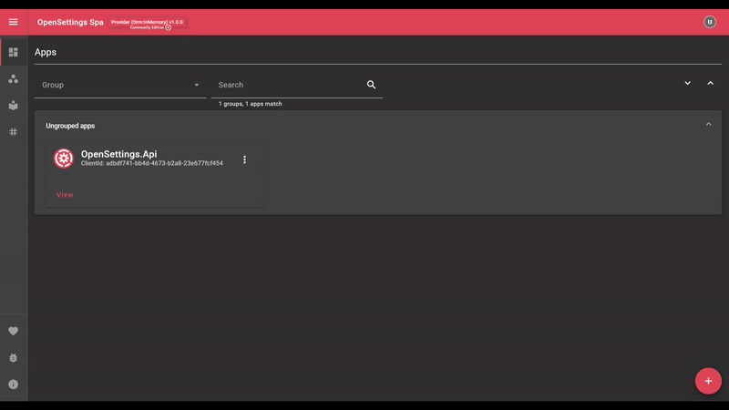

# Getting Started

To integrate OpenSettings into your project, you'll first need to install the required libraries.

### 1️⃣ Install OpenSettings
```sh
dotnet add package OpenSettings.AspNetCore
```

### 2️⃣ Install a Storage Provider
For this guide, we'll use **InMemory storage** for simplicity. Install it with:

```sh
dotnet add package Microsoft.EntityFrameworkCore.InMemory
```

If you're using a different database, replace this package with the appropriate EF Core provider (e.g., `Microsoft.EntityFrameworkCore.SqlServer` for SQL Server).

---

## 🏗 Configuring OpenSettings

OpenSettings can run in two modes: **Provider** or **Consumer**. Choose the appropriate configuration based on your application’s role. For more information check out the [Consumer vs Provider](docs/introduction.md#consumer-vs-provider-what-do-they-mean)

### 🔹 Provider Configuration

```csharp
var openSettingsConfiguration = new OpenSettingsConfiguration(ServiceType.Provider)
{
    Client = new ClientInfo(
        new Guid("adbdf741-bb4d-4673-b2a8-23e677fcf454"), // The unique identifier for the client.
        new Guid("4294a5e3-0839-4358-a03d-1ac52585ae5f")  // The secret key for the client.
    ),
};
```

#### 🗄 Configuring Database Storage

```csharp
// Configure database storage (InMemory for this example)
openSettingsProviderConfiguration.Provider.Orm.ConfigureDbContext = optsBuilder =>
{
    optsBuilder.UseInMemoryDatabase("OpenSettings");
};
```

### 🔹 Consumer Configuration

```csharp
var openSettingsConfiguration = new OpenSettingsConfiguration(ServiceType.Consumer)
{
    Client = new ClientInfo(
        new Guid("71059bda-bb49-447f-ac83-60cd15c9518d"), // The unique identifier for the client.
        new Guid("6c52c9f7-d43c-44c1-8d6c-451bf9029731")  // The secret key for the client.
    ),
	Consumer = new ConsumerConfiguration
    {
      ProviderUrl = "http://localhost:5002/api/settings", // Url of the provider service.
    }
};
```

## 🔧 Registering OpenSettings

### 1️⃣ Enable OpenSettings In The Host Builder

```csharp
await builder.Host.UseOpenSettingsAsync(openSettingsProviderConfiguration);
```

### 2️⃣ Add OpenSettings Controllers

```csharp
builder.Services
    .AddControllers()
    .AddOpenSettingsController(builder.Configuration); // Enables OpenSettings Controllers
```

### 3️⃣ Integrate OpenSettings Middleware
Ensure OpenSettings is registered in the pipeline **between** `UseRouting` and `MapControllers`.

```csharp
...
app.UseRouting();

app.UseOpenSettings(); // Updates instance status when the application starts or stops.
app.UseOpenSettingsSpa(); // Enables OpenSettings SPA for viewing & editing settings.

app.MapControllers();
...
```

---

## 📌 Defining Your First Setting

Define a setting by creating a new class that implements `ISettings`.

```csharp
using OpenSettings.Services.Interfaces;

public class MyFirstSetting : ISettings
{
    public string Name { get; set; }
    public string Description { get; set; }
}
```

Run the application and navigate to ".../settings" to view and manage your settings.



---

## 🔹 Resolving Settings in the Application

You can inject and access your settings using **dependency injection**.

### 🔹 Accessing as a Singleton

Inject the setting directly into your constructor:

```csharp
public class MyService
{
    private readonly MyFirstSetting _myFirstSetting;

    public MyService(MyFirstSetting myFirstSetting)
    {
        _myFirstSetting = myFirstSetting;
    }
}
```

### 🔹 Using IOptions<T> for Configuration Binding

Alternatively, use `IOptions<T>` for accessing configuration-based settings:

```csharp
using Microsoft.Extensions.Options;

public class MyService
{
    private readonly MyFirstSetting _myFirstSetting;

    public MyService(IOptions<MyFirstSetting> options)
    {
        _myFirstSetting = options.Value;
    }
}
```

This approach is useful when the settings are dynamically **loaded from configuration sources**.

> [!NOTE]
> The default settings registration mode is `Both`, meaning it supports both **Singleton** and **IOptions<T>** interfaces. You can change this behavior as needed.

### 🔹 Resolving Settings Without Dependency Injection  

If you need to access settings outside of DI, use `SettingsProvider.GetLocalSettingOrDefault<T>()`. This method returns the setting if found or falls back to the default value if not available.

```csharp
using OpenSettings;

var myFirstSetting = SettingsProvider.GetLocalSettingOrDefault<MyFirstSetting>();
```

## ✅ What's Next?

🔹 **Explore More Quick Start Guides** 
   - [Setting Up The Provider](docs/quick-start-provider.md)  
   - [Setting Up The Consumer](docs/quick-start-consumer.md)  

🔹 **Deep Dive into OpenSettings**  
   - [Configuration Guide](docs/configuration-guide.md) - Learn how to configure OpenSettings.
   - [Consumer Guide](docs/consumer-guide.md) - Learn how to integrate your services to OpenSettings.
   - [Provider Guide](docs/provider-guide.md) - Learn how to configure your Provider.
   - [Security Guide](docs/security-guide.md) to restrict unauthorized access to settings.

---

✨ *OpenSettings makes settings management simple and efficient!* 🚀